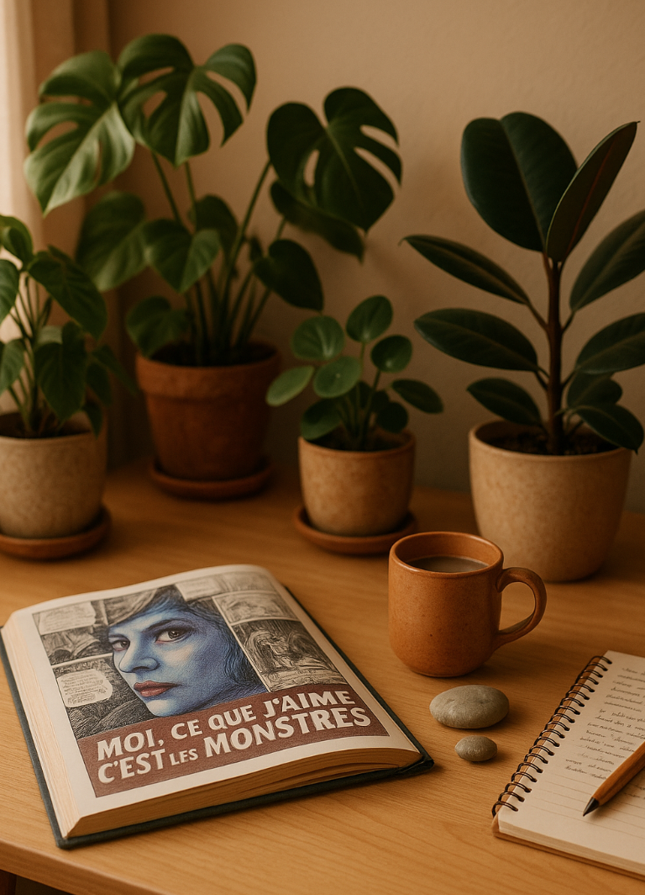

# Béatrice Lebeslour

Hi, I’m Béatrice Lebeslour. I live in France and often travel across Europe, especially to Italy.  
Outside of work, I care for plants and write about how to understand and support their growth. I also have a deep interest in comics and the quiet rituals that shape everyday life.

I use this space to gather personal notes, digital fragments, and small observations.  
I’m not a developer, but I appreciate the clarity of GitHub and the idea of tracing one’s path — even when it’s nonlinear.

🌿 You can visit my personal site here → [green-complice.com](https://www.green-complice.com)

Thanks for stopping by.
